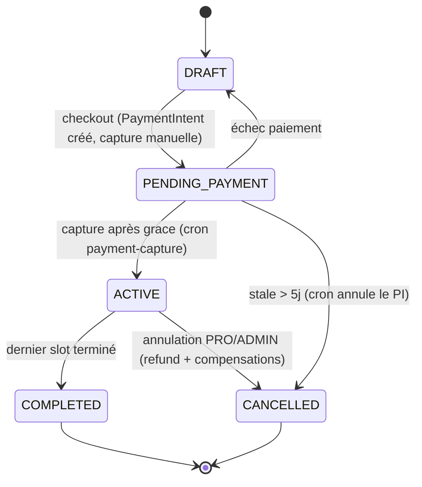
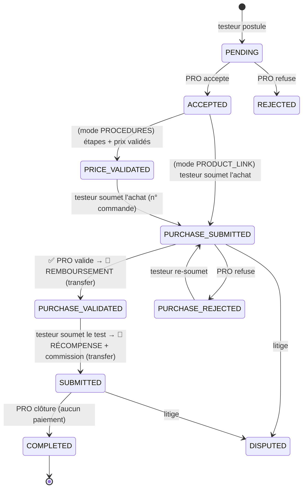
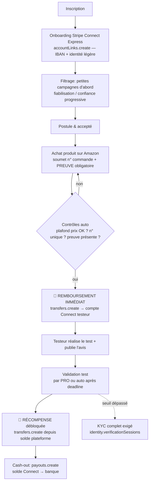
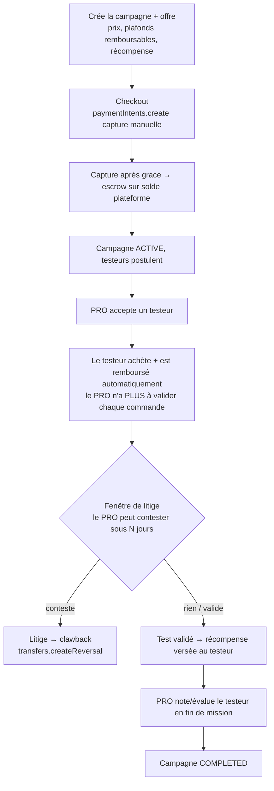
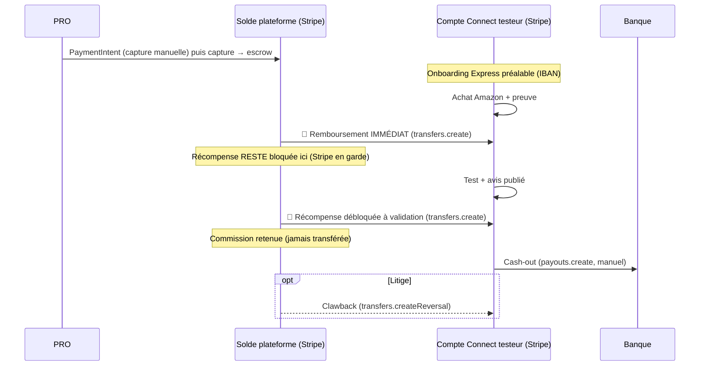

# Workflow de paiement SuperTry — Actuel vs Cible (100 % délégué à Stripe)

**Date :** 23 juin 2026 · **Branche :** `dev`
**Objet :** documenter le flux de paiement réellement implémenté, le flux cible (remboursement immédiat + récompense bloquée), et les fonctions Stripe à utiliser — **sans jamais détenir de fonds en interne** (conformité).

---

## 0. Principe d'architecture (et pourquoi c'est conforme)

Le code utilise déjà le bon modèle Stripe :

- **Comptes Connect `Express`** (`stripe.accounts.create({ type: 'express', business_type: 'individual' })`) → Stripe gère l'onboarding, le KYC, le dashboard et les versements. *Vérifié : `stripe.service.ts:37,51,86`.*
- **`payouts: { schedule: { interval: 'manual' } }`** → les fonds ne quittent pas automatiquement le compte ; on contrôle le moment. *Vérifié : `stripe.service.ts:78-80`.*
- **Separate Charges & Transfers** : on encaisse le PRO sur le **solde de la plateforme**, puis on `Transfer` vers le testeur. *Vérifié : `PlatformWallet` + `createPlatformToConnectTransfer`.*

> **Règle de conformité (ce que tu demandes) :** la « cagnotte » du testeur **= son solde Stripe Connect**, jamais une balance interne que SuperTry détiendrait. La table `Wallet` (`balance`/`pendingBalance`) doit être **uniquement un miroir comptable/affichage**, pas une caisse. Les fonds « en attente » (récompense non encore acquise) restent sur le **solde plateforme Stripe** tant qu'ils ne sont pas transférés — donc Stripe en a la garde, pas nous. Cela évite le statut d'établissement de paiement.

---

## 1. Workflow ACTUEL (implémenté sur `dev`)

### 1.1 Machine à états — Campagne (côté PRO)

### 1.2 Machine à états — Session (côté Testeur) + points de paiement 💸

**Points clés du flux actuel :**

| Étape | Déclencheur | Action argent | Fonction Stripe (réelle) |
|---|---|---|---|
| Checkout campagne | PRO | PaymentIntent **capture manuelle** + `transfer_group` | `paymentIntents.create({ capture_method:'manual', transfer_group })` (`stripe.service.ts:468,478`) |
| Capture | cron `payment-capture` (après grace ~60 min) | Fonds → **solde plateforme** (escrow) | `paymentIntents.capture()` (`:586`) |
| **Remboursement produit** | **PRO** via `validatePurchase` | Transfer plateforme → testeur | `transfers.create()` via `createPlatformToConnectTransfer` (`:846,935`) — *exige `stripeConnectAccountId`* |
| **Récompense + commission** | **Testeur** via `submitTest` | Transfer plateforme → testeur (commission retenue) | idem `transfers.create()` |
| Clôture | PRO via `complete` | Aucun | — |
| Retrait (cash-out) | Testeur | Payout compte Connect → banque | `payouts.create()` (`:1024`) |
| KYC complet | au-delà de `kycRequiredAfterTests` (3) | — | `identity.verificationSessions.create()` (`:771`) |

**Limites du flux actuel (vs ta cible) :**
1. Le **remboursement attend la validation manuelle du PRO** (goulot) — pas immédiat.
2. La **récompense est transférée dehors** dès `submitTest` — elle n'est **pas** « bloquée ».
3. Remboursement & récompense **exigent déjà un compte Connect** (sinon `PAYMENT_TESTER_NO_STRIPE`).
4. La preuve d'achat est **optionnelle** (`purchaseProofKeys?`).
5. Pas de cron d'escalade si le PRO ne valide jamais → session bloquée.

---

## 2. Workflow CIBLE (final)

### 2.1 Principe
- **Remboursement produit = immédiat** à la soumission de l'achat (même au 1ᵉʳ test), pour que le testeur n'avance pas le coût.
- **Récompense = bloquée** : elle reste sur le **solde plateforme Stripe** (Stripe en garde) et n'est **transférée** au testeur qu'à la validation du test/avis.
- **Wallet 100 % Stripe** : la cagnotte du testeur = son solde Connect ; le retrait = payout Stripe. Aucune caisse interne.

### 2.2 Parcours TESTEUR (cible)

### 2.3 Parcours PRO (cible)

### 2.4 Cycle de vie de l'argent (cible) — vue unifiée

---

## 3. Mapping des fonctions Stripe (cible)

| Besoin | Fonction Stripe | État dans le code |
|---|---|---|
| Compte testeur (cagnotte = Stripe) | `accounts.create({ type:'express', payouts:{schedule:{interval:'manual'}} })` | ✅ présent (`stripe.service.ts:37-86`) |
| Onboarding (avant 1ᵉʳ achat) | `accountLinks.create({ type:'account_onboarding' })` | ✅ présent (`:103`) — *à rendre obligatoire avant 1ᵉʳ achat* |
| Encaissement PRO + escrow | `paymentIntents.create({ capture_method:'manual', transfer_group })` + `capture()` | ✅ présent (`:468,586`) |
| **Remboursement immédiat** | `transfers.create({ destination, transfer_group, metadata })` | ✅ fonction présente, ❌ **déclencheur à déplacer** vers la soumission d'achat |
| **Récompense bloquée → débloquée** | garder les fonds sur le solde plateforme, puis `transfers.create` à la validation | ❌ **à implémenter** (aujourd'hui transférée trop tôt à `submitTest`) |
| Commission plateforme | retenue (montant non transféré) — *ou* `application_fee_amount` si bascule en destination charges | ✅ retenue déjà gérée |
| Cash-out testeur | `payouts.create()` (manuel) | ✅ présent (`:1024`) |
| **Clawback / litige** | `transfers.createReversal(transferId, { amount })` | ❌ **à implémenter** (les webhooks gèrent déjà `transfer.reversed` en réception) |
| KYC complet (seuil) | `identity.verificationSessions.create()` | ✅ présent (`:771`) |

---

## 4. Ce qu'il reste à implémenter (gap list)

1. **Remboursement automatique à la soumission.** Déplacer `processPurchaseReimbursement(sessionId)` de `validatePurchase` (PRO) vers `submitPurchase` (testeur) — ou un auto-traitement immédiat. Les plafonds prix/port sont **déjà** vérifiés dans `submitPurchase`.
2. **Preuve d'achat obligatoire + `orderNumber` unique.** Passer `purchaseProofKeys` en `@IsRequired` (≥1) et ajouter une contrainte d'unicité sur `orderNumber` (au moins par campagne). C'est le contrôle automatique qui **remplace l'œil du PRO**.
3. **Récompense bloquée côté Stripe.** Ne plus transférer le bonus à `submitTest`. Le laisser sur le solde plateforme ; déclencher `transfers.create` (récompense) uniquement à la **validation du test** (`complete` PRO **ou** auto-release après deadline). Marquer l'état via un champ `rewardReleasedAt` (idempotence) plutôt qu'une balance interne.
4. **Onboarding Connect avant le 1ᵉʳ achat.** Bloquer l'achat tant que `stripeConnectAccountId` + `payouts_enabled` ne sont pas OK, sinon le remboursement immédiat échouera. Onboarding léger (Express) ; Identity complète reste différée au seuil.
5. **Fenêtre de litige + clawback.** Implémenter `transfers.createReversal` et l'exposer dans le flux `disputes` (réversion partielle/totale du remboursement).
6. **Cron d'escalade des sessions bloquées.** Auto-valider le test ou ouvrir un litige après N jours en `SUBMITTED`/en attente de validation → le testeur n'est jamais bloqué.
7. **Garde anti auto-test.** `testerId !== sellerId` + recoupement compte Connect / IBAN / adresse / device (seul trou que ban+KYC ne couvre pas).
8. **Wallet = miroir.** Confirmer que `Wallet.balance`/`pendingBalance` ne sert qu'à l'affichage/compta et n'est jamais la source de vérité d'un retrait (la source = solde Connect Stripe). Sinon, le retirer du chemin de cash-out.

---

## 5. Décision à trancher (produit)

- **Remboursement strictement immédiat** vs **« immédiat après une courte fenêtre PRO » (24-48 h)** : l'immédiat maximise l'UX testeur ; la fenêtre laisse au PRO une chance de contester *avant* le versement. Recommandation : **immédiat sur les petites campagnes** (faible montant, confiance progressive), **fenêtre courte sur les gros montants**.

---

*Références code : `src/modules/stripe/stripe.service.ts`, `src/modules/payments/payments.service.ts`, `src/modules/test-sessions/test-sessions.service.ts`. Diagrammes Mermaid — rendus dans la plupart des visionneuses Markdown.*
